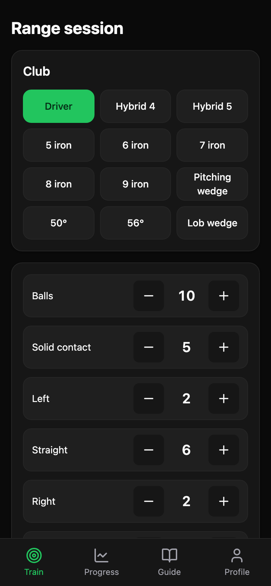
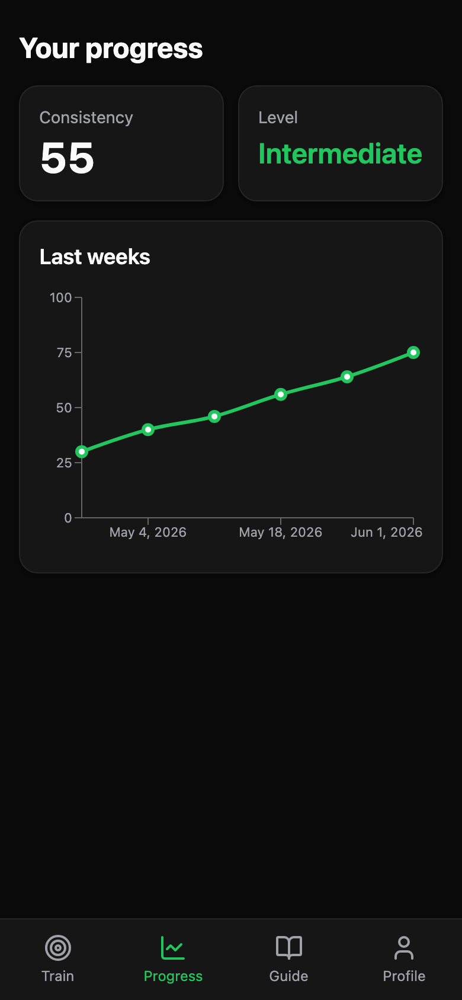
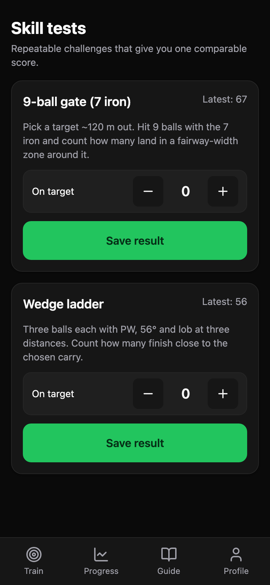
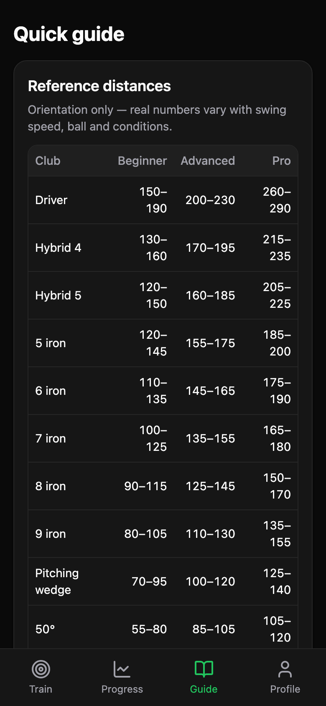
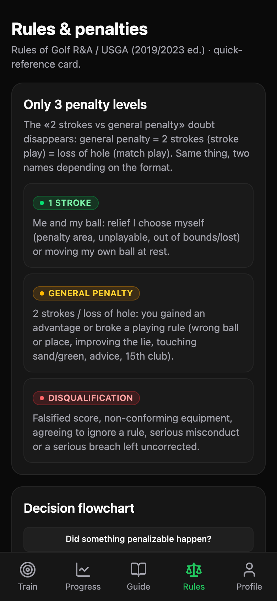
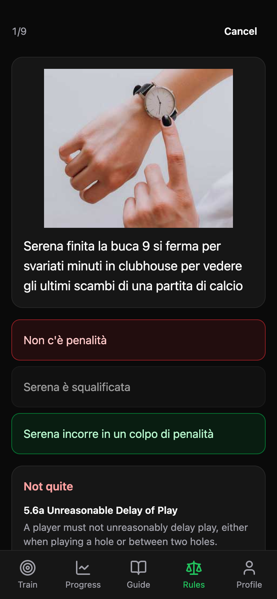

# Golf Practice

A small app I'm building to learn NestJS. The excuse is golf: I just started, I only hit
at the driving range, and I wanted a way to tell whether I'm actually getting better without
writing down every single shot.

So instead of logging shots one by one, you log a *block* — say 10 balls with the 7 iron —
and tap three things: how many were solid, where they went (left / straight / right), and the
rough distance off the range markers. From that the app tracks a consistency score over time
and shows which level you're roughly in. There's also a reference card with expected carry
distances per club and a few fixes for the usual misses, plus a rules card that boils the
penalty system down to three levels with a decision flowchart and the common relief situations.

The backend is where the actual learning happens: NestJS + Prisma + Postgres, auth, and a
sync endpoint. The phone app is local-first, so it works on the range with no signal and
syncs when it gets back online.

<p align="center">
  
  
  
  
  
  
</p>

## Stack

- **API** — NestJS 11, Prisma, PostgreSQL, BetterAuth (email/password), pino logging
- **Web** — React + Vite PWA, Tailwind + shadcn/ui, Dexie (IndexedDB), TanStack Query, Recharts
- **Tooling** — pnpm workspaces, jj, Docker, Jest + Vitest

## Running it

Everything runs in Docker — Postgres, the Mailpit inbox, the API and the web app. You only
need Docker (and [`just`](https://github.com/casey/just) for the shortcuts).

```sh
just dev          # or: docker compose up --build
```

The API container applies pending migrations on start, so there's nothing else to wire up.

- Web: http://localhost:5173
- API: http://localhost:3000/api
- Mailpit (verification / reset emails land here): http://localhost:8025

Source is bind-mounted into the containers, so edits hot-reload. Sign-up sends a verification
email — open Mailpit, click the link, then sign in. The app starts in English; switch to
Italian from the Profile tab, and dates and numbers follow the language.

If file watching feels sluggish (it can on macOS over a bind mount), run the apps on the host
and keep only the infra in Docker:

```sh
pnpm install
just infra        # Postgres + Mailpit only
just migrate      # create/apply migrations
just dev-local    # api + web on the host
```

`just` on its own lists every command.

## Tests

```sh
pnpm --filter @golf/api test         # unit, with coverage gate
pnpm --filter @golf/api test:e2e     # hits a real Postgres (just infra first)
pnpm --filter @golf/web test
```

## How sync works

While you're using the app the phone is the source of truth. Everything you log lands in
IndexedDB (through Dexie) and the screens read straight from there, so nothing needs a
connection. The server only exists to back things up and let another device catch up — sync
is what reconciles the two.

It can afford to be simple, because it's all your own data: two devices almost never touch the
same record at the same moment. Every row that syncs (clubs, sessions, shot blocks) carries an
`updatedAt` that doubles as its version, plus a `deletedAt` — deletes are just a flag, so they
travel like any other edit instead of disappearing.

The client keeps two cursors in a local `meta` table: when it last pushed and when it last
pulled. A push sends every row changed since the push cursor to `POST /api/sync`; the server
keeps each one only if its `updatedAt` beats what it already has (and ignores rows owned by
someone else), then returns its own clock as the next cursor. A pull is the mirror image —
`GET /api/sync?since=<cursor>` hands back everything that changed server-side, deletions
included, and the client keeps whichever copy is newer.

So it's last-write-wins, one row at a time. No operation log, no CRDT — they'd be solving a
conflict this app doesn't have. Sync runs on load and after you finish a session, and because
every write is an upsert keyed by id, running it again changes nothing.

## Quiz data

The rules quiz needs questions, and I didn't want to type out hundreds of them. So there's a
little scraper, `scripts/scrape-quizgolf.ts`, that walks an Italian golf-quiz site one question
at a time and saves each one — the text, the picture, the three answers and which is right — as
plain JSON. The app ships that file and reads it on the phone; once it's scraped, the site is
never touched again.

Nothing to install: Node 22 runs the TypeScript as-is. It drops everything into
`data/quizgolf/` — a `quiz.json` and an `images/` folder — and shows a progress bar so you know
how long it'll take.

```sh
node --experimental-strip-types scripts/scrape-quizgolf.ts            # the whole lot
node --experimental-strip-types scripts/scrape-quizgolf.ts --ids 1,217   # just a couple, to try it
```

If you want to scrape in chunks, `--start` and `--max` move the id window, `--ids` grabs only
the ones you name, and `--delay` changes how long it waits between requests (700ms by default,
to go easy on their server — it also backs off on its own if the host starts rate-limiting).

Get a question wrong and the app shows you the actual rule or definition you missed, in your
language. Those texts come from a second scraper, `scripts/scrape-randa.ts`, which pulls the
official Rules of Golf from randa.org in both Italian and English and keeps them keyed the same
way the questions reference them — so a question about Rule 8.1a can pull up exactly that
passage offline. It writes `data/randa/reference.json`; run it once, no flags needed:

```sh
node --experimental-strip-types scripts/scrape-randa.ts
```

Both datasets live under `apps/web/public/quiz/` once copied in, and the app reads them straight
from there — no rules content is fetched at runtime.
